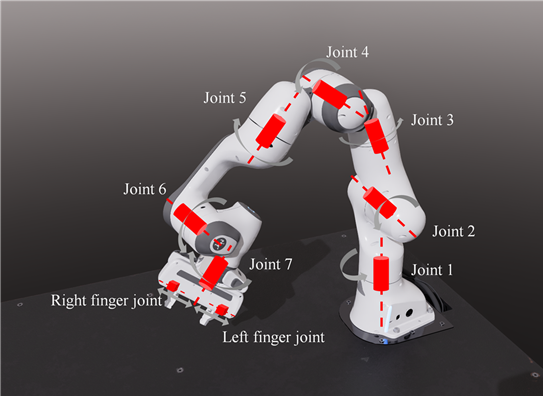
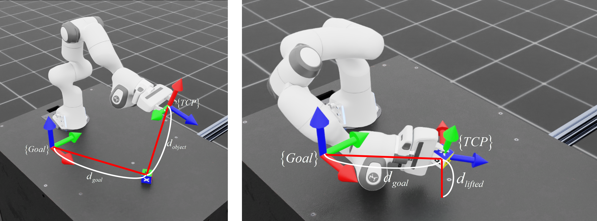
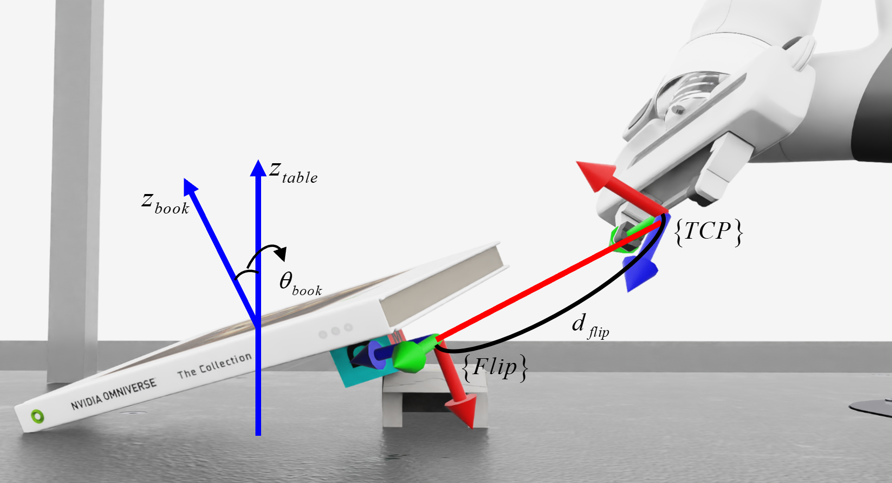

# MDP
- 본 문서에서는 Unstructured env의 grasp과 flip action에 사용된 observation, action space와 reward funtion에 대해 설명합니다.
- 24년 7월 12일 기준으로 설명되어 있으며, 이후의 변경사항이 반영되어 있지 않을 수 있습니다.
# Grasping

## Observation
- Grasping과 flipping 모두 공통적으로 아래 그림과 같은 7-DoF panda manipulator 사용

### Joint position
- $`{\theta _{robot}} = [{\theta _1},{\theta _2},{\theta _3},{\theta _4},{\theta _5},{\theta _6},{\theta _7},{d_{finge{r_L}}},{d_{finge{r_R}}}]`$
- 그리퍼를 포함한 로봇 각 관절의 위치

### Joint velocity
- $`{\dot \theta _{robot}} = [{\dot \theta _1},{\dot \theta _2},{\dot \theta _3},{\dot \theta _4},{\dot \theta _5},{\dot \theta _6},{\dot \theta _7},{\dot d_{finge{r_L}}},{\dot d_{finge{r_R}}}]`$
- 그리퍼를 포함한 로봇 각 관절의 속도

### Position of object
- $`{P_{object}} = [{x_{object}},{y_{object}},{z_{object}}]`$
- Grasp의 대상이 되는 목표 물체의 3D 좌표

### Goal position
- $`{P_{target}} = [{x_{target}},{y_{target}},{z_{target}}]`$
- 목표 물체의 grasp 후 이동할 목표 지점의 3D 좌표

### Actions
- $`{A_{t - 1}} = [{\theta _1},{\theta _2},{\theta _3},{\theta _4},{\theta _5},{\theta _6},{\theta _7},{a_{finger}}]`$
- 가장 최근(이전 step)의 action

## Action
### Joint position(body)
- $`{A_{body}} = [{\theta _1},{\theta _2},{\theta _3},{\theta _4},{\theta _5},{\theta _6},{\theta _7}]`$
- 로봇 각 관절의 위치 명령(7-DoF body)

### Joint position(finger)
- $`{A_{finger}} = [open|close]`$
- 로봇 말단부에 장착된 그리퍼의 열림 또는 닫힘 명령

## Reward function

### Reach
- $`{R_{{d_{object}}}} = 1 - \tanh \left( {\frac{{{d_{object}}}}{{{\alpha _{reach}}}}} \right)`$
- 목표 물체와 그리퍼의 TCP 사이의 거리가 작아질수록 1에 가까워짐

### Lift
- $`{R_{lift}} = \left\{ {\begin{array}{*{20}{c}}1&{{\rm{if}}\,\,{d_{lifted}} \ge {\alpha _{threshold}}}\\0&{{\rm{otherwise}}}\end{array}} \right.`$
- 목표 물체가 초기 높이로부터 상승한 높이가 threshold 이상이면 1, 그렇지 않으면 0을 반환

### Reach goal
- $`{R_{{d_{goal}}}} = \left\{ {\begin{array}{*{20}{c}}{1 - \tanh \left( {\frac{{{d_{goal}}}}{{{\alpha _{reach}}}}} \right)}&{{\rm{if}}\,\,{d_{lifted}} \ge {\alpha _{threshold}}}\\0&{{\rm{otherwise}}}\end{array}} \right.`$
- 목표 물체와 목표 물체가 도달해야 할 목표 지점 사이의 거리가 작아질수록 1에 가까워짐

### Reach goal(fine)
- $`{R_{{d_{goal}}}} = \left\{ {\begin{array}{*{20}{c}}{1 - \tanh \left( {\frac{{{d_{goal}}}}{{{\alpha _{reach_fine}}}}} \right)}&{{\rm{if}}\,\,{d_{lifted}} \ge {\alpha _{threshold}}}\\0&{{\rm{otherwise}}}\end{array}} \right.`$
- Reach goal과 동일하나, 더 가까운 거리에서 추가적인 보상을 부여

### Action rate
- $`{R_A} = \mathop \sum \limits_{}^{} {({A_t} - {A_{t - 1}})^2}`$
- Action의 변화율에 대한 패널티 부여

### Joint velocity
- $`{R_{\dot \theta }} = \mathop \sum \limits_{}^{} {\dot \theta ^{{2^{}}}}`$
- Joint velocity에 대한 패널티 부여

### Sum of grasping rewards
- $`{R_{grasp}} = {R_{{d_{object}}}} + 15{R_{lift}} + 16{R_{{d_{goal}}}} + 5{R_{{d_{goal}}}}^\prime  - 0.001{R_A} - 0.0001{R_{\dot \theta }}`$
- 상기 모든 보상함수에 weight 값을 곱하여 산출되는 grasping의 최종 보상함수 

# Flipping

## Observation
### Joint position
- $`{\theta _{robot}} = [{\theta _1},{\theta _2},{\theta _3},{\theta _4},{\theta _5},{\theta _6},{\theta _7},{d_{finge{r_L}}},{d_{finge{r_R}}}]`$
- 그리퍼를 포함한 로봇 각 관절의 위치

### Joint velocity
- $`{\dot \theta _{robot}} = [{\dot \theta _1},{\dot \theta _2},{\dot \theta _3},{\dot \theta _4},{\dot \theta _5},{\dot \theta _6},{\dot \theta _7},{\dot d_{finge{r_L}}},{\dot d_{finge{r_R}}}]`$
- 그리퍼를 포함한 로봇 각 관절의 속도

### Pose of TCP
- $`{P_{tcp}} = [{x_{tcp}},{y_{tcp}},{z_{tcp}},{w_{tcp}},{q_{{x_{tcp}}}},{q_{{y_{tcp}}}},{q_{{z_{tcp}}}}]`$
- 로봇 말단부에 부착된 tool의 center point pose

### Pose of object(book)
- $`{P_{object{\rm{ }}to{\rm{ }}flip}} = [{x_{object}},{y_{object}},{z_{object}},{w_{object}},{q_{{x_{object}}}},{q_{{y_{object}}}},{q_{{z_{object}}}}]`$
- Flipping의 대상이 되는 object의 3D pose

### Pose for Flipping
- $`{P_{flip}} = [{x_{flip}},{y_{flip}},{z_{flip}},{w_{flip}},{q_{{x_{flip}}}},{q_{{y_{flip}}}},{q_{{z_{flip}}}}]`$
- Object의 flipping이 시작되는 3D pose

### Actions
- $`{A_{t - 1}} = [{\theta _1},{\theta _2},{\theta _3},{\theta _4},{\theta _5},{\theta _6},{\theta _7},{a_{finger}}]`$
- 가장 최근(이전 step)의 action

## Action
- Grasping action과 동일함
### Joint position(body)
- $`{A_{body}} = [{\theta _1},{\theta _2},{\theta _3},{\theta _4},{\theta _5},{\theta _6},{\theta _7}]`$
- 로봇 각 관절의 위치 명령(7-DoF body)

### Joint position(finger)
- $`{A_{finger}} = [open|close]`$
- 로봇 말단부에 장착된 그리퍼의 열림 또는 닫힘 명령

## Reward function

### Reach 
- $`{R_{reach}} = \left\{ {\begin{array}{*{20}{c}}{2 \cdot {\rm{exp}}( - {\alpha _{reach}} \cdot {d_{object}})}&{{\rm{if}}\,\,{d_{object}} \le {\alpha _{threshold}}}\\{{\rm{exp}}( - {\alpha _{reach}} \cdot {d_{object}})}&{{\rm{otherwise}}}\end{array}} \right.`$
- Flipping pose와 그리퍼의 TCP 사이의 거리가 작아질수록 1에 가까워짐, threshold 이하에서는 2배 부여

### Align
- $`{R_{align}} = 1 - {\rm{tanh}}(\angle ({q_{flip}} \cdot {({q_{TCP}})^{ - 1}}))`$
- Flipping pose의 orientation와 TCP pose의 orientation 사이의 상대 사원수 값에서 추출한 axis-angle 값 중 angle의 차이가 감소할수록 1에 가까워짐

### Lift
- $`{R_{lift}} = \left\{ {\begin{array}{*{20}{c}}1&{{\rm{if}}\,\,{d_{lifted}} \ge {\alpha _{threshold}}}\\0&{{\rm{otherwise}}}\end{array}} \right.`$
- Flipping 대상 물체가 초기 높이로부터 상승한 높이가 threshold 이상이면 1, 그렇지 않으면 0을 반환

### Flip
- $`{R_{flip}} = \tanh \left( { - \cos \left( {{\theta _{book}}} \right)} \right)`$
- Flipping 대상 물체가 책상과 이루는 각도가 증가할수록 보상

### Homing
- $`{R_{home}} = \left\{ {\begin{array}{*{20}{c}}{1 - \tanh \left( {\Theta  - {\Theta _{home}}} \right)\,\,\,\,\,\,\,\,if\,\cos \left( {{\theta _{book}}} \right) \le 0}\\{0\,\,\,\,\,\,\,\,\,\,\,\,\,\,\,\,\,\,\,\,\,\,\,\,\,\,\,\,\,\,\,\,\,{\rm{otherwise}}}\end{array}} \right.`$
- Flipping후 로봇이 home configuration으로 돌아가기 위해, 현재 configuration과 home configuration의 차이가 작을수록 1에 가까워지는 보상함수

### Action rate
- $`{R_A} = \mathop \sum \limits_{}^{} {({A_t} - {A_{t - 1}})^2}`$
- Action의 변화율에 대한 패널티 부여

### Joint velocity
- $`{R_{\dot \theta }} = \mathop \sum \limits_{}^{} {\dot \theta ^{{2^{}}}}`$
- Joint velocity에 대한 패널티 부여

### Sum of flipping rewards
- $`{R_{flip}} = 0.5{R_{reach}} + 0.5{R_{align}} + 10{R_{lift}} + 10{R_{flip}} + 10{R_{\hom e}} - 0.001{R_A} - 0.0001{R_{\dot \theta }}`$
- 상기 모든 보상함수에 weight 값을 곱하여 산출되는 flipping의 최종 보상함수 
